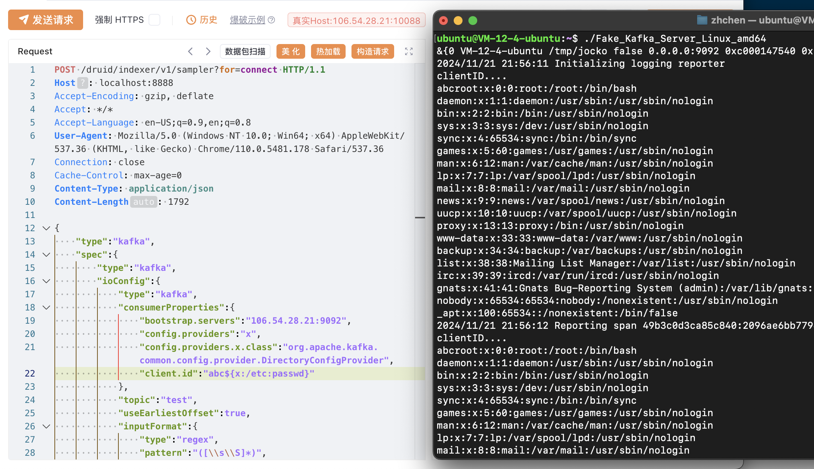

# Fake_Kafka_Server

## Quick Start
``` shell
$ GOOS=linux GOARCH=amd64 go build -o Fake_Kafka_Server_Linux_amd64
$ chmod +x ./Fake_Kafka_Server_Linux_amd64
$ ./Fake_Kafka_Server_Linux_amd64 
&{0 VM-12-4-ubuntu /tmp/jocko false 0.0.0.0:9092 0xc000147540 0xc00011c8f0 false 0 false [] [] false 127.0.0.1:9093 5s 1m0s 3}
2024/11/21 21:52:26 Initializing logging reporter
```

